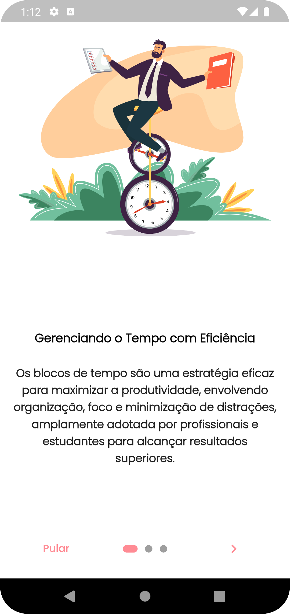
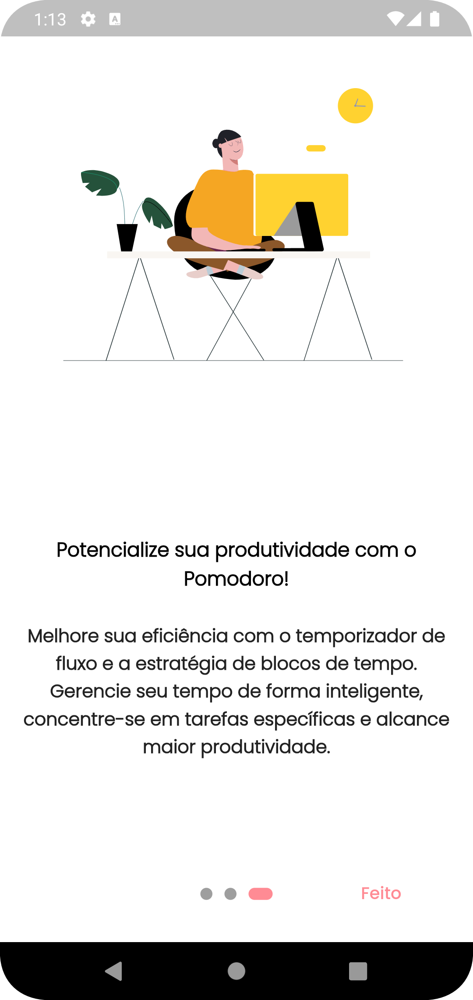
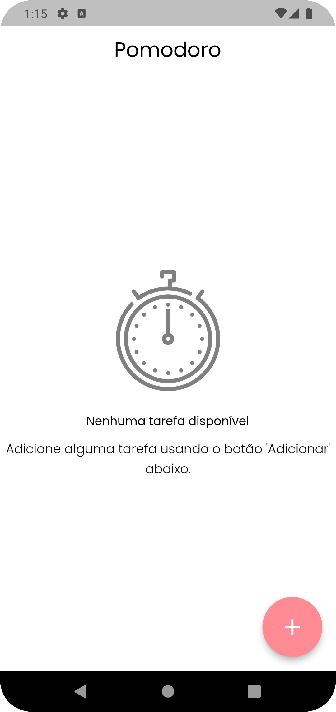
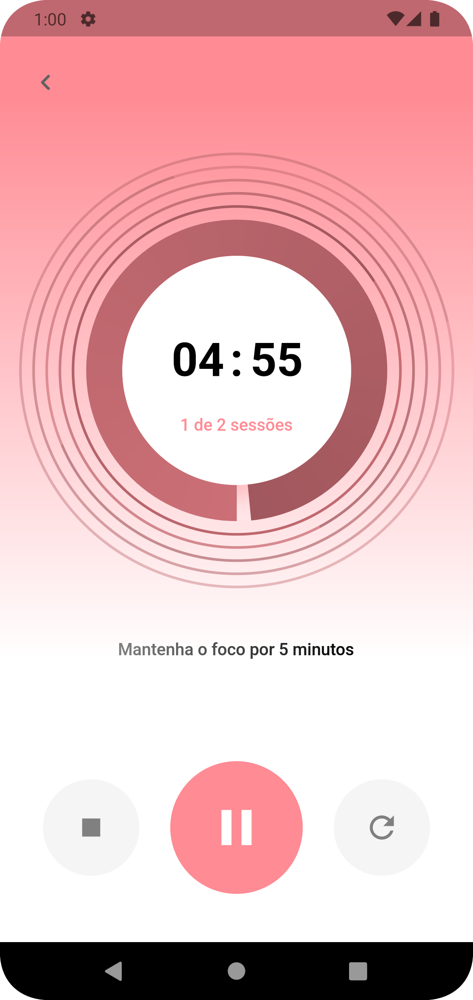

## Sobre o projeto

O Pomodoro é uma técnica de gerenciamento de tempo que pode aumentar sua concentração e reduzir o cansaço ao realizar tarefas diárias. Com esta aplicação, você pode aplicar a técnica Pomodoro de forma eficaz para obter melhores resultados em suas atividades.

### Tecnologias utilizadas

- **Dart**: Linguagem de programação utilizada no desenvolvimento.
- **Flutter**: Framework para construção de interfaces de usuário multiplataforma.
- **GetX**: Biblioteca utilizada para gerenciamento de estado e navegação na aplicação.
- **MVC**: Arquitetura de software utilizada para organizar e estruturar o código-fonte.
- **GetX Pattern**: Padrão de gerenciamento de estado e navegação que facilita a manutenção e escalabilidade do projeto.
- Utilização de animações para proporcionar uma experiência de usuário mais agradável e envolvente.

### Funcionalidades Principais
- Divida suas tarefas diárias em seções de tempo desejadas.
- Faça pequenas pausas após cada seção de trabalho.
- Após completar o número desejado de seções de trabalho, faça uma pausa mais longa para manter a prontidão física e mental.

## Demonstração

## Contribuindo

Contribuições são bem-vindas! Sinta-se à vontade para abrir uma issue para relatar bugs, solicitar novas funcionalidades ou enviar pull requests com melhorias para o projeto.